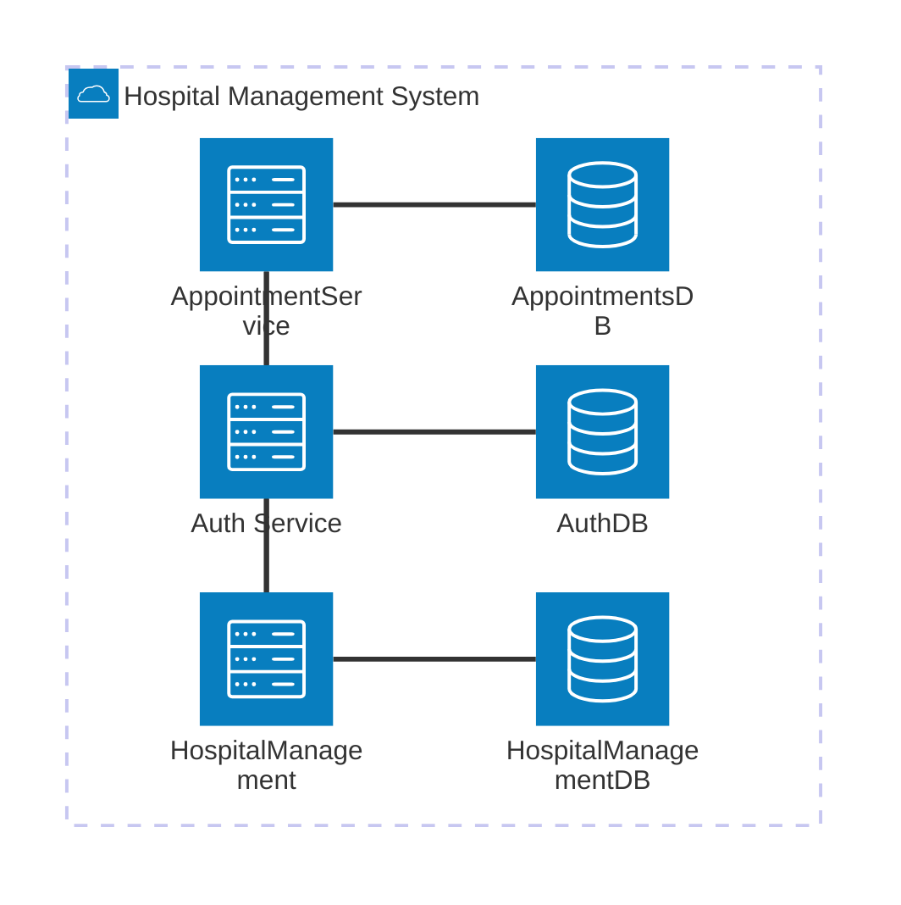

# Hospital Management System

A backend REST API for managing hospital operations, built with .NET 8 and structured
as a set of microservices handling authentication, core domain data, and appointment
scheduling independently.

## Tech stack

- **Runtime**: .NET 8, ASP.NET Core Web API
- **ORM**: Entity Framework Core 8 with SQL Server
- **Auth**: JWT Bearer via `Microsoft.AspNetCore.Authentication.JwtBearer`
- **Mapping**: AutoMapper
- **Validation**: FluentValidation
- **Logging**: NLog
- **Containerisation**: Docker, Docker Compose
- **Testing**: NUnit, Moq
- **Documentation**: Swagger / Swashbuckle

## Architecture

This system is built as a set of microservices, each owning its own database and
communicating over HTTP.

### Services

**Auth Service** (`HospitalManagement.Auth`) handles all authentication concerns —
user registration, login, and JWT token issuance. It is the only service that generates
tokens. All other services validate incoming tokens using the same shared signing key
but never generate them.

**HMS API** (`HospitalManagement`) owns the core domain entities: Doctor,
DoctorSchedule, Patient, and Procedure catalog. It exposes standard CRUD endpoints
for each and serves as the source of truth for all non-appointment data.

**Appointment Service** (`HospitalManagement.Appointments`) owns everything
appointment-related: Appointment, AppointmentProcedure, Treatment, and the discount
calculator. It maintains its own database and communicates with the Main HMS API via
live HTTP calls to validate and look up Doctor, Patient, Procedure, and DoctorSchedule
data at request time. To avoid cross-service joins at read time, key fields (doctor name,
patient name, procedure name and price) are snapshotted onto appointment records at
creation time.

### Shared library

`HospitalManagement.Shared` is a class library referenced by all three services. It
contains shared primitives: `Result<T>`, `PagedResult<T>`, and `BaseController`. It has
no runtime dependency on any service and is not deployed independently.
