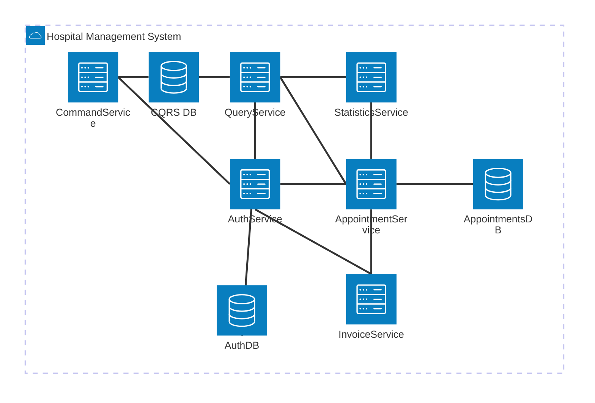

# Hospital Management System

A backend REST API for managing hospital operations, built with .NET 8 and structured
as a set of microservices handling authentication, core domain data, and appointment
scheduling independently.

## Tech stack

- **Runtime**: .NET 8, ASP.NET Core Web API
- **ORM**: Entity Framework Core 8 with SQL Server
- **Auth**: JWT Bearer via `Microsoft.AspNetCore.Authentication.JwtBearer`
- **Mapping**: AutoMapper
- **Validation**: FluentValidation
- **Logging**: NLog
- **Containerisation**: Docker, Docker Compose
- **Testing**: NUnit, Moq
- **Documentation**: Swagger / Swashbuckle

## Architecture

This system is built as a set of microservices, each owning its own database and
communicating over HTTP.

```mermaid
architecture-beta
    group system(cloud)[Hospital Management System]

    %% Databases
    service cqrsdb(database)[CQRS DB] in system
    service authdb(database)[AuthDB] in system
    service appdb(database)[AppointmentsDB] in system

    %% Services
    service command(server)[CommandService] in system
    service auth(server)[AuthService] in system
    service app(server)[AppointmentService] in system
    service query(server)[QueryService] in system
    service invoice(server)[InvoiceService] in system
    service stats(server)[StatisticsService] in system

    %% Database ownership
    command:R -- L:cqrsdb
    query:L -- R:cqrsdb
    auth:T -- B:authdb
    app:R -- L:appdb

    %% Authentication (JWT)
    auth:L -- R:command
    auth:R -- L:app
    auth:T -- B:query
    auth:B -- T:invoice

    %% Business communication
    app:L -- R:query
    invoice:T -- B:app
    stats:B -- T:app
    query:R -- L:stats
```

### Services

**Auth Service** (`HospitalManagement.Auth`) handles all authentication concerns —
user registration, login, and JWT token issuance. It is the only service that generates
tokens. All other services validate incoming tokens using the same shared signing key
but never generate them.

**Command Service** (`HospitalManagement.CommandService`) is the write side of the
core domain. It owns Doctor, DoctorSchedule, Patient, and Procedure data in the CQRS
database and publishes changes to RabbitMQ.

**Query Service** (`HospitalManagement.QueryService`) is the read side of the core
domain. It serves Doctor, DoctorSchedule, Patient, and Procedure data from the CQRS
database and is the source other services call to look these up.

**Appointment Service** (`HospitalManagement.Appointments`) owns everything
appointment-related: Appointment, AppointmentProcedure, Treatment, and the discount
calculator. It has its own database and calls the Query Service over HTTP to validate
and look up doctors, patients, and schedules. Procedure name and price are
snapshotted onto appointment records at creation time, so later catalog changes do not
alter past appointments. It also exposes `GET /api/appointment/stats-data`, a flat
list of appointments with discounted totals used by the Statistics Service.

**Invoice Service** (`HospitalManagement.InvoiceService`) generates PDF and DOCX
invoices (English or Montenegrin) for completed appointments. It has no database and
fetches appointment data from the Appointment Service.

**Statistics Service** (`HospitalManagement.Statistics`) provides read-only aggregates
for the statistics dashboard: doctor load and revenue, procedure revenue, and patient
statistics. It has no database; it aggregates data from the Appointment and Query
services and caches results in Redis for 5 minutes. Downstream calls use Polly
(retry, circuit breaker, timeout). All endpoints take `from` and `to` dates.

### Shared library

`HospitalManagement.Shared` is a class library referenced by all services. It contains
shared primitives (`Result<T>`, `PagedResult<T>`, `BaseController`), the token-forwarding
HTTP handler, and shared DTOs and enums such as `AppointmentStatus`. It has no runtime
dependency on any service and is not deployed independently.
